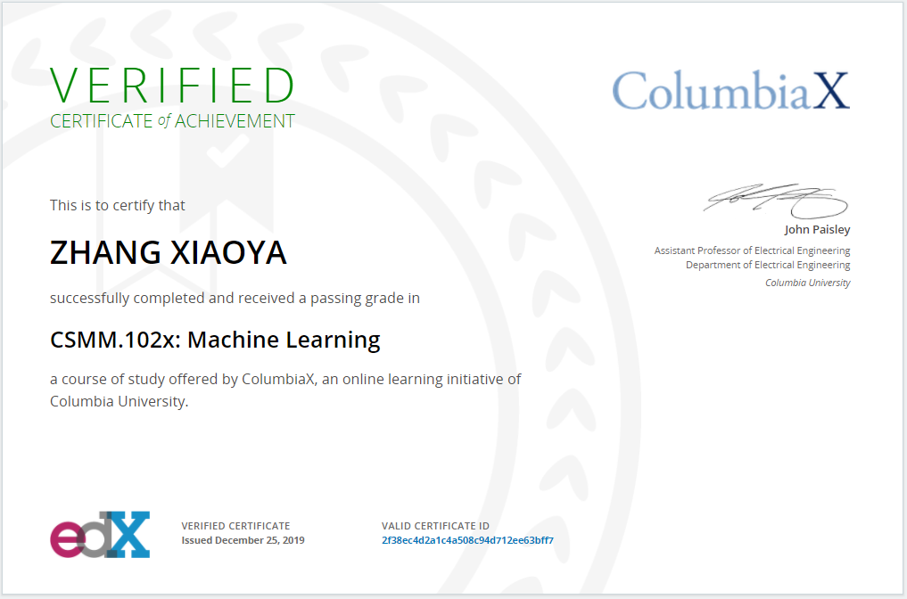

# ColumbiaU-ML-Algorithm-Course

Project Description: NumPy implementations of various ML models  

    Project_1: Ridge Regression and Active learning

    Project_2: KNN and Bayes Cassifier

    Project_3: K-means and EM Gaussian mixture_models

    Project_4: Probabilistic Matrix Factorization Model

This course provides an in-depth understanding to supervised and unsupervised techniques for machine learning. it has covered both probabilistic and non-probabilistic approaches to machine learning. Focus will be on classification and regression models, clustering methods, matrix factorization and sequential models.

Methods covered in this course include linear and logistic regression, support vector machines, boosting, K-means clustering, mixture models, expectation-maximization algorithm, hidden Markov models, among others. 

